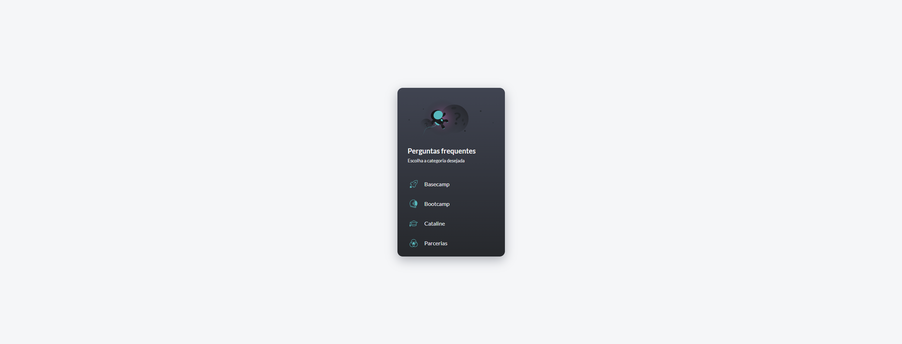

# Central de ajuda



> Projeto de desafio utilizando a ferramenta de gerenciamento de estado Vuex para construção de uma "Central de Ajuda".

## 🛠 Tecnologias

- **Front-End**
  - [HTML](https://developer.mozilla.org/pt-BR/docs/Web/HTML)
  - [CSS](https://developer.mozilla.org/pt-BR/docs/Web/CSS)
  - [Javascript](https://developer.mozilla.org/pt-BR/docs/Web/Javascript)
  - [Vue](https://vuejs.org/)
  - [Vuex](https://vuex.vuejs.org/)


## 📐 Layout
O layout utilizado foi desenvolvido pela [Cataline](https://www.cataline.io/) e é restrito aos alunos do Bootcamp.

## 💻 Pré-requisitos

Antes de começar, verifique se você atendeu aos seguintes requisitos:
<!---Estes são apenas requisitos de exemplo. Adicionar, duplicar ou remover conforme necessário--->
* Você instalou a versão mais recente do [Node.js](https://nodejs.org/en/).
* Você instalou a versão mais recente do [Git](https://git-scm.com/).

## ⬇ Instalando o projeto

Para instalar o projeto, siga estas etapas:

```bash
# Faça o download do projeto para sua máquina, pelo próprio github ou através do terminal utilizando:
$ git clone https://github.com/ronaldfront/faq-vuex

# Acesse o projeto, no caso do projeto, utilizando:
$ cd desafio-vuex

# Instale as depedências do Node.js
$ npm install
```

## ☕ Usando o projeto

Para usar o projeto, siga estas etapas:

```bash
# Rode o servidor local através do comando:
$ npm run dev

# Em seguinda acesse o servidor local através do seu navegador, na porta "especificada" pelo output do terminal.
```

## 📂 Estrutura do diretório

```
|-- public/
|-- src/
    |-- assets/
        |-- css/
        |-- fonts/
        |-- images/
    |-- components/
    |-- store/
    |-- utils/
    |-- App.vue
    |-- main.js
|-- .browserslistrc
|-- .eslintrc.js
|-- .gitignore
|-- .prettierrc.md
|-- babel.config.js
|-- package-lock.json
|-- package.json
|-- package-lock.json
|-- README.md
|-- LICENSE.md
```

## 📝 Licença

Esse projeto está sob licença MIT. Veja o arquivo [LICENÇA](LICENSE.md) para mais detalhes.

[⬆ Voltar ao topo](#)<br>

